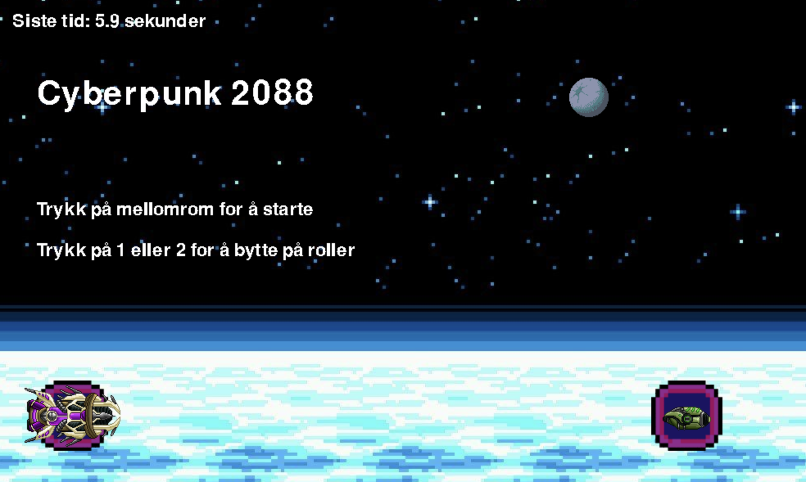

# Cyberpunk 2088

Cyberpunk 2088 is a game developed in Python during my second year of high school. This two-player game lets you play against another player on the same computer.

## Screenshot

## How to Play

- **Press the spacebar** to start the game.
- **Press 1 or 2** to switch roles.
- **Controls:** The player on the left uses the controls WASD to steer the spaceship, while the player on the right uses the arrows.

## Requirements for running

- Python 3.x
- Pygame (or any other dependencies your game might have)

## Gameplay

- **Big vs small spaceship** The big spaceship is trying to catch the small spaceship. When this happens, the game ends. The objective of the game is to survive for as long as possible as the small spaceship.

## Controls

- **Spacebar**: Start the game
- **1**: Switch to role 1
- **2**: Switch to role 2

## Acknowledgments

Thanks to my high school teacher and classmates who provided support and feedback during the development of this game.
